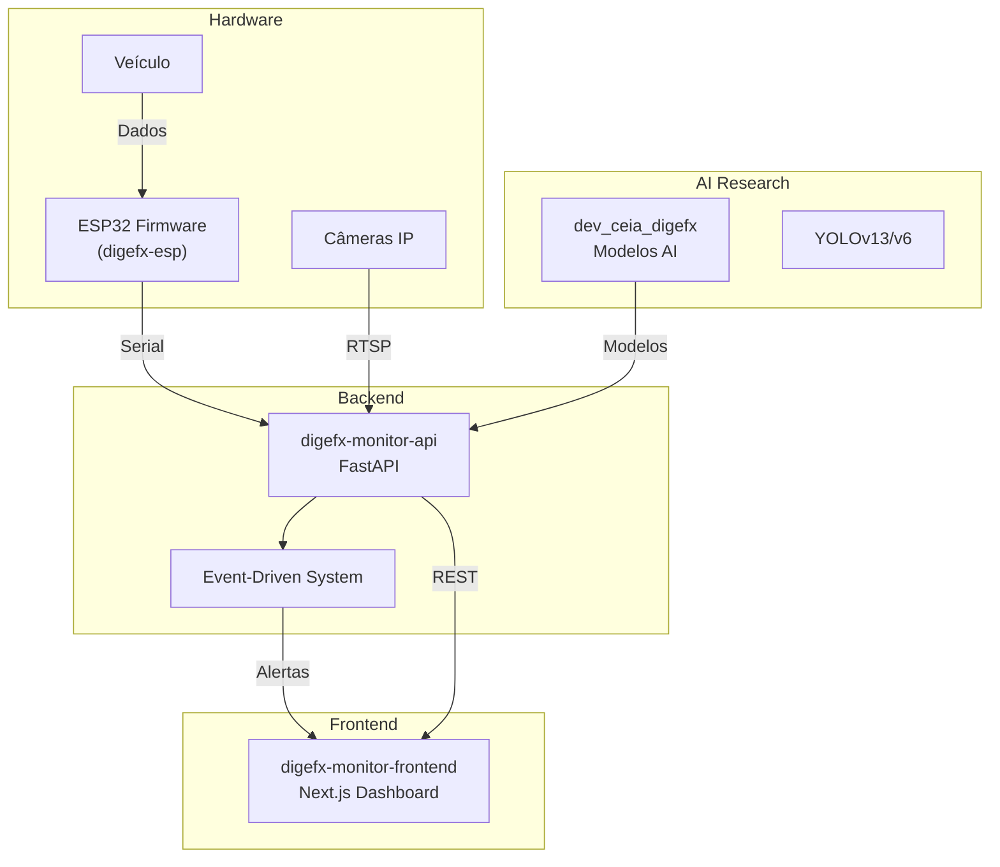

# 👁️ Smart Vision - CEIA × DIGEFx

<div align="center">


## Sistema Integrado de Monitoramento Veicular Inteligente

**🧠 CEIA** (Centro de Excelência em IA) × **🏭 DIGEFx** (Soluções Industriais)

**Visão Computacional • IoT • Segurança do Trabalho • Automação Industrial**

[🌐 GitHub Pages](https://digefx-ceia.github.io/smartvision) • [📖 Documentação Completa](../PROJETO-CEIA-DIGEFX-OVERVIEW.md)

</div>

---

## 🎯 Visão Geral

O **Smart Vision** combina **Inteligência Artificial**, **IoT** e **Visão Computacional** para monitoramento veicular avançado com foco em **segurança do trabalho** e **automação industrial**.

### 🎯 Objetivos Principais

| 🛡️ Segurança | 🚗 Monitoramento | 🧠 IA |
|---|---|---|
| Detecção de EPIs e zonas de risco | Controle inteligente de energia e GPS | Modelos YOLO em tempo real |

---

## 🏗️ Arquitetura do Sistema



### 📈 Fluxo de Dados

1. **📡 Captura**: ESP32 + Câmeras → Dados de veículo e imagens
2. **🧮 Processamento**: Modelos YOLO → Detecções + Event-driven → Alertas
3. **📤 Distribuição**: MQTT/AMQP/Database → Múltiplos canais
4. **🖥️ Interface**: Dashboard → Tempo real + Mapas GPS

---

## 📦 Repositórios do Projeto

### 🔬 [dev_ceia_digefx](https://github.com/DIGEFx-CEIA/dev_ceia_digefx) - Pesquisa & IA

**Modelos YOLO + Scripts de Processamento**

- 🧠 **Tecnologias**: `Python` `YOLOv13` `YOLOv6` `PyTorch` `OpenCV`
- 🎯 **Classes**: PESSOA, COM_CAPACETE, COM_LUVA, CONE, SINALIZACAO, etc.
- 📊 **Zonas**: Risco (2m) + Controlada (4m)
- ✅ **Funcionalidades**: Processamento lote, tracking, estimativa 3D

### 🔧 [digefx-esp](https://github.com/DIGEFx-CEIA/digefx-esp) - Firmware IoT

**ESP32 para Controle Veicular**

- ⚡ **Tecnologias**: `C++` `Arduino` `PlatformIO` `ESP32` `GPS`
- 🔋 **Controle**: 2 relés + monitoramento bateria + proteção voltagem
- 📍 **GPS**: Localização otimizada + SBAS/WAAS
- 📡 **Comunicação**: Serial configurável + persistência

### 🖥️ [digefx-monitor-api](https://github.com/DIGEFx-CEIA/digefx-monitor-api) - Backend

**FastAPI + Event-Driven System**

- 🚀 **Tecnologias**: `FastAPI` `SQLAlchemy` `PyTorch` `MQTT` `AMQP`
- ⚡ **Arquitetura**: Event-driven + processamento paralelo
- 🔐 **Segurança**: JWT + autenticação completa
- 📊 **Monitoramento**: Sistema + ESP32 + câmeras

### 🎨 [digefx-monitor-frontend](https://github.com/DIGEFx-CEIA/digefx-monitor-frontend) - Interface

**Dashboard Responsivo Next.js**

- 🖥️ **Tecnologias**: `Next.js 15` `React 19` `TypeScript` `Material-UI`
- 📊 **Dashboard**: Métricas tempo real + polling 10s
- 🗺️ **Mapas**: GPS interativo + Leaflet
- 💻 **Terminal**: Comandos remotos + gerenciamento câmeras

---

## 📊 Status de Desenvolvimento

### ✅ **Implementado**
- ✅ Firmware ESP32 completo
- ✅ Sistema event-driven da API  
- ✅ Modelos YOLO treinados
- ✅ Interface web responsiva
- ✅ Autenticação e segurança

### 🔄 **Em Desenvolvimento**
- 🔄 Integração AI na API
- 🔄 Processamento vídeo tempo real
- 🔄 Configuração handlers externos
- 🔄 Testes integração

### 📋 **Planejado**
- 📋 Deploy Docker
- 📋 Monitoramento Grafana
- 📋 Backup automático
- 📋 Documentação deploy

---

## 🎯 Características Principais

| ⚡ Performance | 🛡️ Robustez | 📈 Escalabilidade | 📊 Observabilidade |
|---|---|---|---|
| Event-driven paralelo | Tolerância falhas | Múltiplas câmeras | Logs estruturados |

---

## 🚀 Quick Start

### 1. 🔧 ESP32
```bash
cd digefx-esp
pio run --target upload
```

### 2. 🖥️ Backend
```bash
cd digefx-monitor-api
pip install -r requirements.txt
uvicorn main:app --host 0.0.0.0 --port 8000
```

### 3. 🎨 Frontend
```bash
cd digefx-monitor-frontend
npm install && npm run dev
```

### 4. 🧠 AI Models
```bash
cd dev_ceia_digefx
conda create -n yolov13 python=3.11
conda activate yolov13
pip install -r requirements.txt
```

---

## 🎯 Casos de Uso

### 🛡️ **Segurança do Trabalho**
- Detecção automática EPIs
- Controle zonas segurança
- Alertas proximidade tempo real

### 🚗 **Gestão Veicular**
- Controle energia inteligente
- Rastreamento GPS completo
- Telemetria bateria/ignição

### 🏭 **Automação Industrial**
- Sistema event-driven escalável
- Integração MQTT/AMQP
- API REST para integração

---

## 💻 Tecnologias

### Backend/AI
`FastAPI` `PyTorch` `YOLOv13/v6` `OpenCV` `SQLAlchemy` `MQTT` `AMQP`

### Frontend  
`Next.js 15` `React 19` `TypeScript` `Material-UI` `Leaflet` `NextAuth.js`

### Hardware/IoT
`ESP32` `C++` `Arduino` `PlatformIO` `GPS` `MQTT`

### Infraestrutura
`Docker` `RabbitMQ` `Frigate` `SQLite` `Grafana`

---

## 🤝 Parceria

### 🧠 **CEIA** - Centro de Excelência em IA
- Pesquisa e desenvolvimento IA
- Modelos visão computacional
- Algoritmos processamento avançado

### 🏭 **DIGEFx** - Soluções Industriais
- Implementação sistemas IoT
- Hardware ambiente industrial  
- Infraestrutura deploy

---

## 📚 Documentação

- 📖 **[Overview Completo](../PROJETO-CEIA-DIGEFX-OVERVIEW.md)** - Documentação técnica detalhada
- 🏗️ **[Event-Driven Architecture](https://github.com/DIGEFx-CEIA/digefx-monitor-api/blob/main/EVENT-DRIVEN.md)** - Sistema de alertas
- 🔧 **[Manual ESP32](https://github.com/DIGEFx-CEIA/digefx-esp/blob/main/README.md)** - Hardware e firmware
- 🧠 **[Modelos AI](https://github.com/DIGEFx-CEIA/dev_ceia_digefx/blob/main/README.md)** - YOLOv13/v6 e processamento

---

<div align="center">

**🎉 Smart Vision - Transformando Segurança através da IA 🎉**

Copyright © 2025 Smart Vision - Parceria CEIA × DIGEFx


</div>